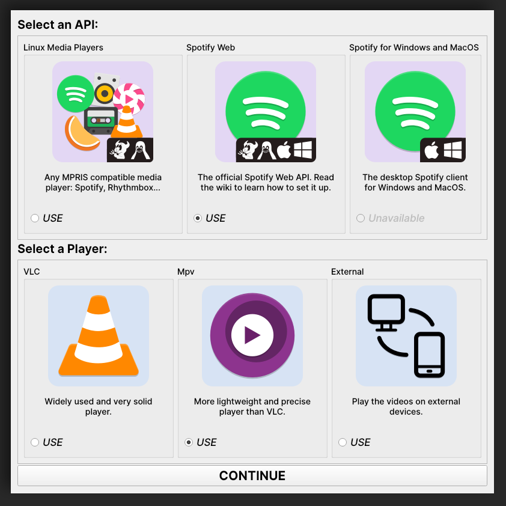

<div align="center">


<h1>Vidify</h1>
<span>Watch <b>music videos in real-time</b> for the songs playing on your device</span>

<a href="https://travis-ci.com/vidify/vidify"></a> <a href="https://pypi.org/project/vidify/"></a> <a href="https://aur.archlinux.org/packages/vidify/"></a>


</div>

READMEs: [🇬🇧](README.md) [🇳🇱](README-nl_NL.md)

## Table of contents
* [Installation](#installation)
    * [The APIs](#the-apis)
    * [The Players](#the-players)
        * [The External Player](#the-external-player)
    * [Audio Synchronization](#audio-synchronization)
* [Usage and configuration](#usage)
* [FAQ](#faq)
* [Development resources](#development)
    * [Tests](#tests)
    * [Current Limitations](#current-limitations)


## Installation
Vidify is intended to be modular. By default, it includes support for the most popular music players (a.k.a. [APIs](#the-apis)). Same goes for the [video players](#the-players) (currently, [VLC](https://www.videolan.org/vlc/index.html) by default). This can be extended by installing the required dependencies listed in their sections.

Here are the different ways to install Vidify, depending on your Operating System:

* **Cross-platform:** With [pip](https://pypi.org/project/vidify): `pip install --user vidify`. Optional APIs and Players can be installed with `pip install --user vidify[extra1,extra2]`, which is equivalent to installing the list of dependencies needed for `extra1` and `extra2`.
* **Windows or Linux:** Using the binaries from the [latest stable releases](https://github.com/vidify/vidify/releases). These include support for all optional APIs, and use mpv as the player.
* **Linux:**
    * Any distro: you can use [snap](https://snapcraft.io/vidify-qt) to install it: `snap install vidify-qt`.
    * Arch Linux: you can install it from the AUR: [`vidify`](https://aur.archlinux.org/packages/vidify/). Maintained by me ([marioortizmanero](https://github.com/marioortizmanero)).
    * Gentoo Linux: there's an ebuild maintained by [AndrewAmmerlaan](https://github.com/AndrewAmmerlaan) in the [GURU overlay](https://wiki.gentoo.org/wiki/Project:GURU) at [media-video/vidify](https://gpo.zugaina.org/media-video/vidify): `eselect repository enable guru && emerge --sync guru && emerge vidify`
    * *Feel free to upload it to your distro's repositories! Let me know in an issue so that I can add it to this list.*

*Note: Vidify requires Python >= 3.6.*

### The APIs
An API is simply a source of information about the music playing on a device. For example, the Spotify desktop client, or iTunes. Here are the currently supported ones:

| Name                                         | Wiki link                                                                 | Extra requirements              | Description |
|----------------------------------------------|:-------------------------------------------------------------------------:|---------------------------------------|-------------|
| Linux Media Players (`mpris_linux`\*)        | [🔗](https://github.com/vidify/vidify/wiki/Linux-Media-Players)           | *Installed by default* (see the wiki) | Any MPRIS compatible media player for Linux or BSD (99% of them, like Spotify, Clementine, VLC...). |
| Spotify for Windows & MacOS (`swspotify`\*)  | [🔗](https://github.com/vidify/vidify/wiki/Spotify-for-Windows-and-MacOS) | *Installed by default*                | The Spotify desktop app for Windows & MacOS, using the [SwSpotify](https://github.com/SwagLyrics/SwSpotify) library. |
| Spotify Web (`spotify_web`\*)                | [🔗](https://github.com/vidify/vidify/wiki/Spotify-Web-API)               | *Installed by default*                | The official Spotify Web API, using [Tekore](https://github.com/felix-hilden/tekore). Check the wiki for more details on how to set it up. |

\* The name inside parenthesis is used as a key for the [arguments](#usage) and the [config](#the-config-file) options. `--api mpris_linux` would force using the Linux Media Players API, for instance. It's also used for the extra dependencies installation with pip: `pip install vidify[extra1]` would install all the extra requirements for `extra1` with pip.

### The players
The embedded video players inside the app. The default one is VLC because it's more popular, but you can use others if you have the player itself installed, and the Python extra dependencies.

| Name                  | Extra requirements                                | Description                                                                                                | Arguments/config options                      |
|-----------------------|---------------------------------------------------|------------------------------------------------------------------------------------------------------------|-----------------------------------------------|
| VLC (`vlc`)           | [VLC](https://www.videolan.org/vlc/#download)     | The default video player. Widely used and very solid.                                                      |`--vlc-args <VLC_ARGS>`                        |
| Mpv (`mpv`)           | [Mpv](https://mpv.io/installation/), `python-mpv` | A command-line portable video player. More lightweight and precise than VLC.                               | `--mpv-flags <MPV_ARGS>` (only boolean flags) |
| External (`external`) | Installed by default                              | Play the videos on external devices. Check the [external players section](#the-external-player) for more.  | None                                          |

For now, the only way to specify what player to use is with [arguments](#usage) or inside the [config file](#the-config-file) with the internal name. You can use `--player mpv` or save it in your config file for future usage:

```ini
[Defaults]
player = mpv
```

#### The external player
The external player lets you play Vidify's music videos essentially anywhere. It will send all the music video information to an external application. Here are the current implementations:

* **Vidify TV**: available on Android, Android TV and Amazon Fire Stick TV. [Play Store page](https://play.google.com/store/apps/details?id=com.glowapps.vidify).

### Audio synchronization
Vidify has an audio synchronization feature. The full repository is in [vidify/audiosync](https://github.com/vidify/audiosync). It's still Work-In-Progress.

Audiosync is only available on Linux for now. It's strongly recommended to use Mpv as the video player. You can install it with `pip install vidify[audiosync]`, along with the following dependencies:

* FFTW: `libfftw3` on Debian-based distros.
* ffmpeg: `ffmpeg` on most repositories. It must be available on your path.
* pulseaudio: `pulseaudio`, pre-installed on most repos.
* youtube-dl: this is installed by default with Vidify, but make sure it's available on your path.

It's also available as [`vidify-audiosync`](https://aur.archlinux.org/packages/vidify-audiosync) on the AUR, and it comes pre-installed in the vidify snap.

It can be activated with `--audiosync`, or inside your [config file](#the-config-file):

```ini
[Defaults]
audiosync = true
```

You can calibrate the audiosync results with the option `--audiosync-calibration` or `audiosync_calibration`. By default it's 0 milliseconds, but it may depend on your hardware.

*Note: if when using audiosync there's no sound, you might need to disable stream target device restore by editing the corresponing line in `/etc/pulse/default.pa` to `load-module module-stream-restore restore_device=false`.*

*Note 2: you should make sure that the sink being recorded is either `audiosync`, or the one where the music is playing. Here's an example on Pavucontrol (it's usually called 'Monitor of ...'):*


## Usage
The app has an interface that will guide you through most of the set-up, but you can use command line arguments and the config file for more advanced options (and until the GUI is completely finished):

<div align="center">

</div>


```
usage: vidify [-h] [-v] [--debug] [--config-file CONFIG_FILE] [-n] [-f] [--dark-mode] [--stay-on-top]
              [--width WIDTH] [--height HEIGHT] [-a API] [-p PLAYER] [--audiosync]
              [--audiosync-calibration AUDIOSYNC_CALIBRATION] [--vlc-args VLC_ARGS]
              [--mpv-flags MPV_FLAGS] [--client-id CLIENT_ID] [--client-secret CLIENT_SECRET]
              [--redirect-uri REDIRECT_URI]
```

| Argument                         | Description         |
|----------------------------------|---------------------|
| `-n`, `--no-lyrics`              | do not print lyrics. |
| `-f`, `--fullscreen`             | play videos in fullscreen mode. |
| `--dark-mode`                    | enables dark mode for the GUI. |
| `--stay-on-top`                  | the app window will stay on top of other apps. |
| `--width <WIDTH>`                | set the width for the downloaded videos (this is useful to play lower quality videos if your connection isn't good). |
| `--height <HEIGHT>`              | set the height for the downloaded videos. |
| `-a`, `--api`                    | specify the API to use. See the [APIs section](#the-apis) for more info about the supported APIs. |
| `-p`, `--player`                 | specify the player to use. See the [Players section](#the-players) for more info about the supported players. |
| `--audiosync`                    | enables the [Audio Synchronization](#audio-synchronization) feature (disabled by default). |
| `--audiosync-calibration`        | You can calibrate the delay in milliseconds audiosync returns with this. It can be positive or negative. The default is 0ms. |
| `--config-file <PATH>`           | indicate the path of your [config file](#the-config-file).  |

### The config file
The configuration file is created by default at your usual config directory:

* Linux: `~/.config/vidify/config.ini` (or in `$XDG_CONFIG_HOME`, if defined)
* Mac OS X: `~/Library/Preferences/vidify/config.ini`
* Windows: `C:\Users\<username>\AppData\Local\vidify\vidify\config.ini`

You can use a custom one by passing `--config-file <PATH>` as an argument. The config file is overriden by the configuration passed as arguments, but keeps your settings for future usage. [Here's an example of one](https://github.com/vidify/vidify/blob/master/example.ini). It uses the [INI config file formatting](https://en.wikipedia.org/wiki/INI_file). Most options are inside the `[Defaults]` section.

All the available options for the config file are the same as the arguments listed in the [Usage section](#usage), except for `--config-file <PATH>`, which is only an argument. Their names are the same but with underscores instead of dashes. For example, `--use-mpv` would be equivalent to `use_mpv = true`.

## FAQ
### Vidify doesn't work correctly with Python 3.8 and PySide2
PySide2 started supporting Python 3.8 with the 5.14 release. Make sure you're using an updated version and try again. `TypeError: 'Shiboken.ObjectType' object is not iterable` will be raised otherwise.

### `ModuleNotFoundError: No module named 'gi'` when using a virtual environment
For some reason, `python-gobject` may not be available inside a virtual environment. You can create a symlink inside it with:

```bash
ln -s "/usr/lib/python3.8/site-packages/gi" "$venv_dir/lib/python3.8/site-packages"
```

or install it with pip following [this guide](https://pygobject.readthedocs.io/en/latest/getting_started.html).

### Vidify doesn't recognize some downloaded songs
If the song doesn't have a metadata field with its title and artist (the latter is optional), Vidify is unable to know what song is playing. Try to modify the metadata of your downloaded songs with VLC or any other tool.

### `FileNotFoundError: Could not find module 'libvlc.dll'.`
Make sure that both Python and VLC are either 32 bits, or 64 bits, but not different. You should have a directory called `C:\Program Files (x86)\VideoLAN\VLC` (32b), or `C:\Program Files\VideoLAN\VLC` (64b).

---

## Development
Helpful documentation links for contributing:
* [DBus](https://dbus.freedesktop.org/doc/dbus-specification.html), [pydbus](https://github.com/LEW21/pydbus), [MPRIS](https://specifications.freedesktop.org/mpris-spec/latest/Player_Interface.html#Property:Position), [Qt for Python](https://wiki.qt.io/Qt_for_Python).
* [python-vlc](https://www.olivieraubert.net/vlc/python-ctypes/doc/), [python-mpv](https://github.com/jaseg/python-mpv).

The app logo was created by [xypnox](https://github.com/xypnox) in this [issue](https://github.com/vidify/vidify/issues/26).

The changelog and more information about this program's versions can be found in the [Releases page](https://github.com/vidify/vidify/releases).

### External player implementations
The Vidify external player has an open protocol for anyone to implement their own app or program to play the videos. You can read more about how it works in this [wiki article](https://github.com/vidify/vidify/wiki/%5BDEV%5D-External-Player-Protocol).

### Tests
You can run the module locally with `python -m vidify`.

This project uses `unittest` for testing. Run them with `python -m unittest`. You'll need all the extra dependencies installed for this to work.
