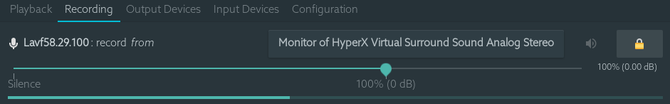

<div align="center">


<h1>Vidify</h1>
<span>Watch <b>music videos</b> and <b>lyrics</b> for the songs playing on your device</span>

  

<hr>


</div>


## Table of contents
* [Requirements](#requirements)
* [Installation](#installation)
    * [The APIs](#the-apis)
    * [The Players](#the-players)
    * [Audio Synchronization](#audio-synchronization)
* [Usage and configuration](#usage)
* [FAQ](#faq)
* [Development resources](#development)
    * [Tests](#tests)
    * [Current Limitations](#current-limitations)


## Requirements
* Python 3.6+
* Other dependencies dependending on what [API](#the-apis) and [player](#the-players) you're going to use.

## Installation
* With pip: `pip install --user vidify`. Other APIs and Players can be used by installing the extra required packages with `pip install --user vidify[extra1,extra2]`. Read the [APIs section](#the-apis) and the [Players section](#the-players) for more. By default, Vidify includes the Spotify APIs and VLC as the player.
* You can download the latest stable [release](https://github.com/vidify/vidify/releases). You will find binaries for Windows and Linux for the stable releases.
* Linux:
    * Any distro: you can use snap to install it: `snap install vidify-qt`
    * Arch Linux: you can install it from the AUR: [`vidify`](https://aur.archlinux.org/packages/vidify/). Maintained by me ([marioortizmanero](https://github.com/marioortizmanero)).
    * Gentoo: there's an e-build maintained by [AndrewAmmerlaan](https://github.com/AndrewAmmerlaan) at [media-video/vidify](https://packages.gentoo.org/packages/media-video/vidify).
    * *Feel free to upload it to your distro's repositories! Let me know in an issue so that I can add it to this list.*


### The APIs
An API is simply a source of information about the music playing on a device. For example, the Spotify desktop client, or iTunes. This app is built to support any API as easily as possible, because there are many different ways to play music. Here are the currently supported ones:

| Name                                         | Wiki link                                                                           | Extra requirements | Description |
|----------------------------------------------|:-----------------------------------------------------------------------------------:|--------------------|-------------|
| Linux Media Players (`mpris_linux`)          | [🔗](https://github.com/vidify/vidify/wiki/Linux-Media-Players)           | None (see wiki)    | Any MPRIS compatible media player for Linux or BSD (99% of the media players, like Spotify, Clementine, VLC...). |
| Spotify for Windows & MacOS (`swspotify`)    | [🔗](https://github.com/vidify/vidify/wiki/Spotify-for-Windows-and-MacOS) | None               | The Spotify desktop app for Windows & MacOS, using the [SwSpotify](https://github.com/SwagLyrics/SwSpotify) library. |
| Spotify Web (`spotify_web`)                  | [🔗](https://github.com/vidify/vidify/wiki/Spotify-Web-API)               | None               | The official Spotify Web API, using [Tekore](https://github.com/felix-hilden/tekore). Check the wiki for more details on how to use it. |
| Unknown (any other string)                   | -                                                                                   | -                  | If you use any other string with `--api`, the initial screen to choose an API will appear. This is temporary until the GUI menu is implemented. |

The internal name inside parenthesis is used for the [arguments](#usage) and the [config](#the-config-file) options. `--api mpris_linux` would enable the Linux Media Players API, for instance.

### The players
The embedded video players inside the app. External players are used because they have better support and already come with codecs installed. The default one is VLC because it's more popular, but you can use others if you have the player installed, and the PyPi extra dependencies. For example, to install Vidify with Mpv support, you'd run `pip install --user vidify[mpv]`, or just installing `python-mpv` in your system.

| Name           | Extra requirements | Description                                           | Arguments/config options                      |
|----------------|--------------------|-------------------------------------------------------|-----------------------------------------------|
| VLC (`vlc`)    | Default            | The default video player. Widely used and very solid. |`--vlc-args <VLC_ARGS>`                        |
| Mpv (`mpv`)    | `python-mpv`       | A simple and portable video player.                   | `--mpv-flags <MPV_ARGS>` (only boolean flags) |

For now, the only way to specify what player to use is with [arguments](#usage) or inside the [config file](#the-config-file) with the internal name. You can use `--player mpv` or save it in your config file for future usage:

```ini
[Defaults]
player = mpv
```

### Audio synchronization
Vidify has an audio synchronization feature currently under testing. The full repository is in [vidify/audiosync](https://github.com/vidify/audiosync), being a separate repo so that it can be installed optionally, and to keep Vidify modular.

This feature is only available on Linux for now. And this feature is much more precise on a lightweight video player like Mpv. You can install it with `pip install vidify[audiosync]`, along with the following dependencies:

* FFTW: `libfftw3` on Debian-based distros.
* ffmpeg: `ffmpeg` on most repositories. It must be available on your path.
* youtube-dl: this is installed by default with Vidify, but make sure it's available on your path.

It's also available as [`vidify-audiosync`](https://aur.archlinux.org/packages/vidify-audiosync) on the AUR, and it comes pre-installed in the vidify snap.

Finally, you can activate the feature with `--audiosync` or inside your [config file](#the-config-file):

```ini
[Defaults]
audiosync = true
```

You can calibrate the audiosync results with the option `--audiosync-calibration` or `audiosync_calibration`. By default it's -800 milliseconds, but it may depend on your hardware.

*Note: if the audiosync module is seemingly doing nothing, or returning zero as the lag always, make sure that the sink being recorded is the one where the music is playing too. Here's an example on Pavucontrol (it's usually called 'Monitor of ...'):*



## Usage
The app has an interface that will guide you through most of the set-up, but you can use command line arguments and the config file for more advanced options (and until the GUI is completely finished).

```
usage: vidify [-h] [-v] [--debug] [--config-file CONFIG_FILE] [-n] [-f] [--dark-mode] [--stay-on-top]
              [--width WIDTH] [--height HEIGHT] [-a API] [-p PLAYER] [--audiosync]
              [--audiosync-calibration AUDIOSYNC_CALIBRATION] [--vlc-args VLC_ARGS]
              [--mpv-flags MPV_FLAGS] [--client-id CLIENT_ID] [--client-secret CLIENT_SECRET]
              [--redirect-uri REDIRECT_URI]
```

| Argument                         | Description         |
|----------------------------------|---------------------|
| `-n`, `--no-lyrics`              | do not print lyrics. |
| `-f`, `--fullscreen`             | play videos in fullscreen mode. |
| `--dark-mode`                    | enables dark mode for the GUI. |
| `--stay-on-top`                  | the app window will stay on top of other apps. |
| `--width <WIDTH>`                | set the width for the downloaded videos (this is useful to play lower quality videos if your connection isn't good). |
| `--height <HEIGHT>`              | set the height for the downloaded videos. |
| `-a`, `--api`                    | specify the API to use. See the [APIs section](#the-apis) for more info about the supported APIs. |
| `-p`, `--player`                 | specify the player to use. See the [Players section](#the-players) for more info about the supported players. |
| `--audiosync`                    | enables the [Audio Synchronization](#audio-synchronization) feature (disabled by default). |
| `--audiosync-calibration`        | You can calibrate the delay in milliseconds audiosync returns with this. It can be positive or negative. The default is -800. |
| `--config-file <PATH>`           | indicate the path of your [config file](#the-config-file).  |

### The config file
The configuration file is created by default at your usual config directory:

* Linux: `~/.config/vidify/config.ini` (or in `$XDG_CONFIG_HOME`, if defined)
* Mac OS X: `~/Library/Preferences/vidify/config.ini`
* Windows: `C:\Users\<username>\AppData\Local\vidify\vidify\config.ini`

You can use a custom one by passing `--config-file <PATH>` as an argument. The config file is overriden by the configuration passed as arguments, but keeps your settings for future usage. [Here's an example of one](https://github.com/vidify/vidify/blob/master/example.ini). It uses the [INI config file formatting](https://en.wikipedia.org/wiki/INI_file). Most options are inside the `[Defaults]` section.

All the available options for the config file are the same as the arguments listed in the [Usage section](#usage), except for `--config-file <PATH>`, which is only an argument. Their names are the same but with underscores instead of dashes. For example, `--use-mpv` would be equivalent to `use_mpv = true`.

## FAQ

### Vidify doesn't work correctly with Python 3.8 and PySide2
PySide2 started supporting Python 3.8 with the 5.14 release. Make sure you're using an updated version and try again. `TypeError: 'Shiboken.ObjectType' object is not iterable` will be raised otherwise.

### `ModuleNotFoundError: No module named 'gi'` when using a virtual environment
For some reason, `python-gobject` may not be available inside a virtual environment. You can create a symlink inside it with:

```bash
ln -s "/usr/lib/python3.8/site-packages/gi" "$venv_dir/lib/python3.8/site-packages"
```

or install it with pip following [this guide](https://pygobject.readthedocs.io/en/latest/getting_started.html).

### Vidify doesn't recognize some downloaded songs
If the song doesn't have a metadata field with the title and the artist (the latter is optional), Vidify is unable to know what song is playing. Try to modify the metadata of your downloaded songs with VLC or any other tool.

---

## Development
Helpful documentation links for contributing:
* [DBus](https://dbus.freedesktop.org/doc/dbus-specification.html), [pydbus](https://github.com/LEW21/pydbus), [MPRIS](https://specifications.freedesktop.org/mpris-spec/latest/Player_Interface.html#Property:Position), [Qt for Python](https://wiki.qt.io/Qt_for_Python).
* [python-vlc](https://www.olivieraubert.net/vlc/python-ctypes/doc/), [python-mpv](https://github.com/jaseg/python-mpv).

The app logo was created by [xypnox](https://github.com/xypnox) in this [issue](https://github.com/vidify/vidify/issues/26).

The changelog and more information about this program's versions can be found in the [Releases page](https://github.com/vidify/vidify/releases).

### Tests
You can run the module locally with `python -m vidify`.

This project uses `unittest` for testing. Run them with `python -m unittest`.
