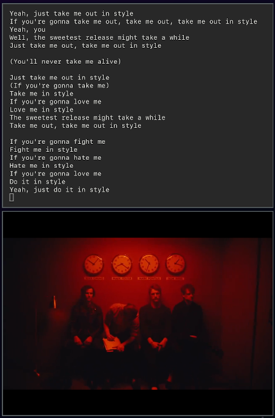

# Spotify Videoclips

A simple tool to show Youtube **videoclips** and **lyrics** for the currently playing Spotify songs with VLC.

## Dependencies

* `youtube-dl`: used to download the videos since the VLC python API doesn't seem to be able to do it directly
* `python-vlc`: used to open a pop-up with the videos

## How to install

The project is currently in progress. An installation guide will be provided once it's finished. 

## TODO

* Clean up the vlc module, maybe create a class to access the properties
* Check [PropertiesChanged](https://dbus.freedesktop.org/doc/dbus-specification.html) rather than the current ugly manual check
* Use better lyrics API/module

## Documentation

Helpful documentation links for contributing:
* [DBus](https://dbus.freedesktop.org/doc/dbus-specification.html)
* [MPRIS](https://specifications.freedesktop.org/mpris-spec/latest/Player_Interface.html#Property:Position)
* [python-vlc](https://www.olivieraubert.net/vlc/python-ctypes/doc/)
* [youtube-dl](https://github.com/ytdl-org/youtube-dl)

